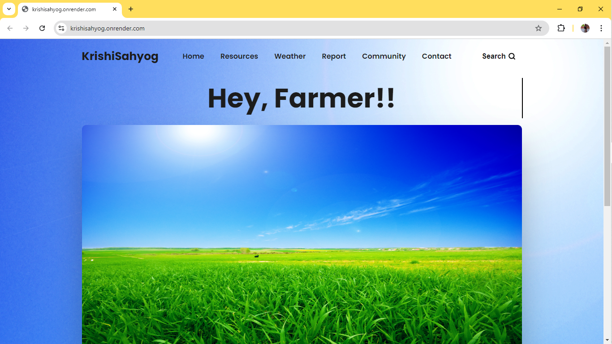
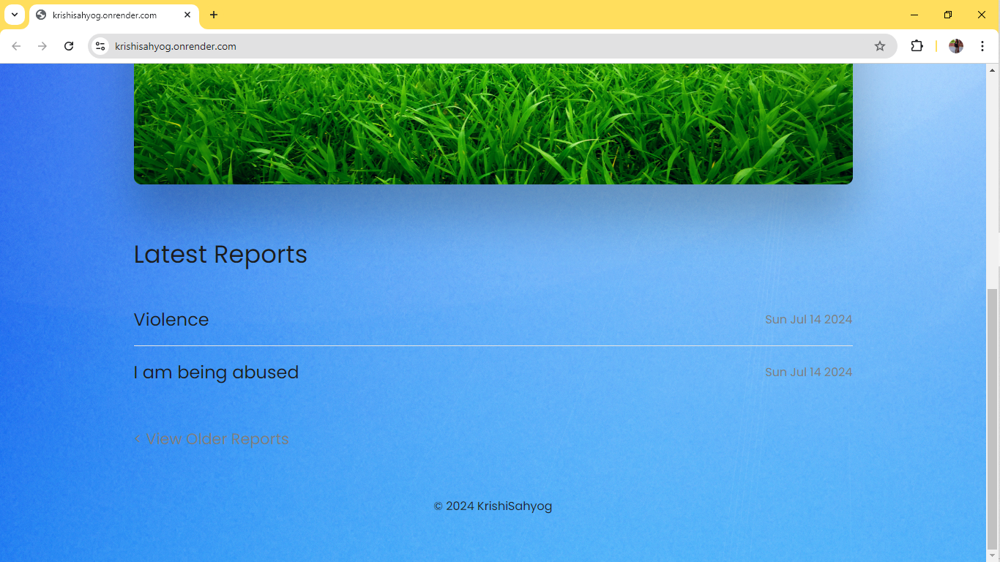
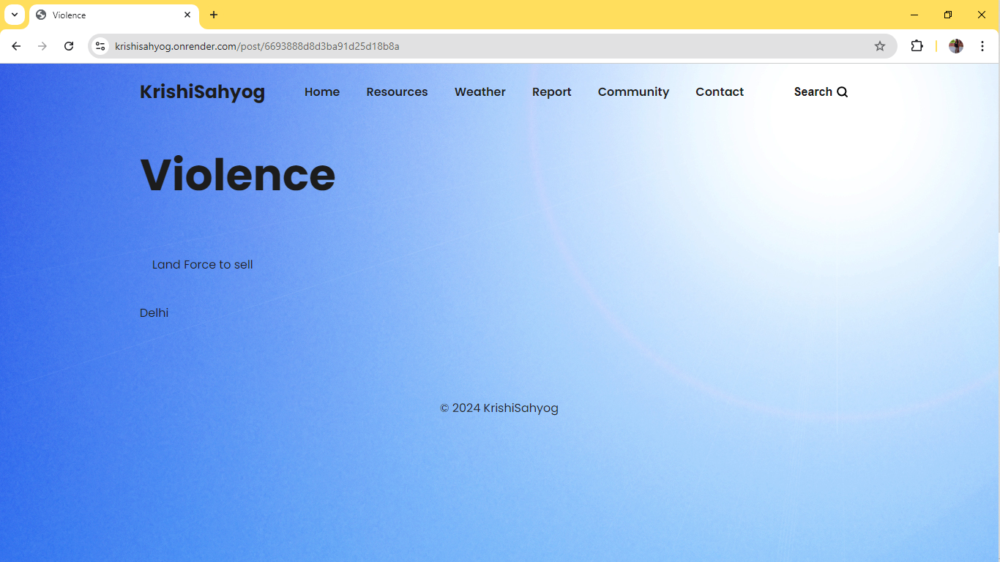
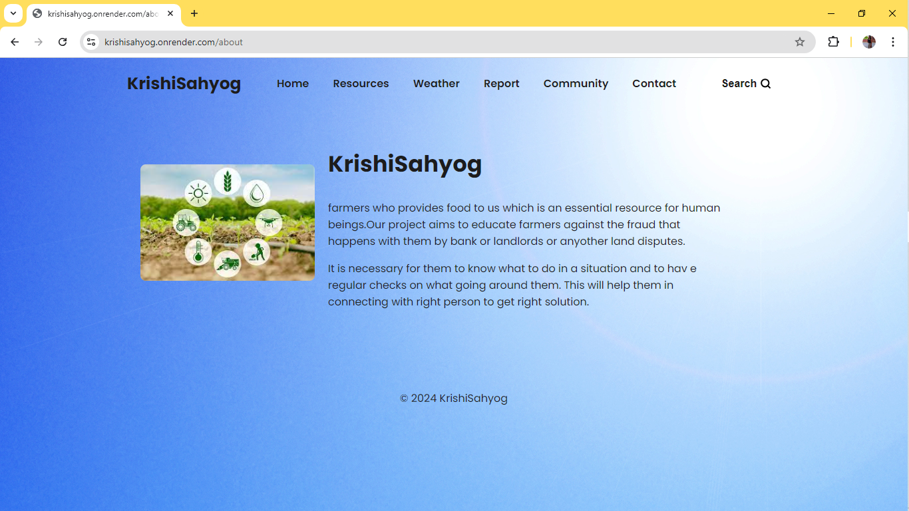
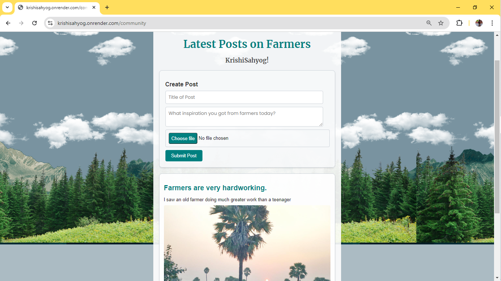
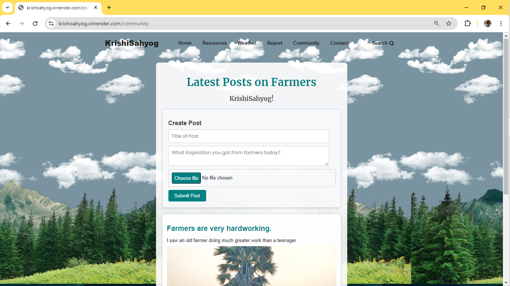
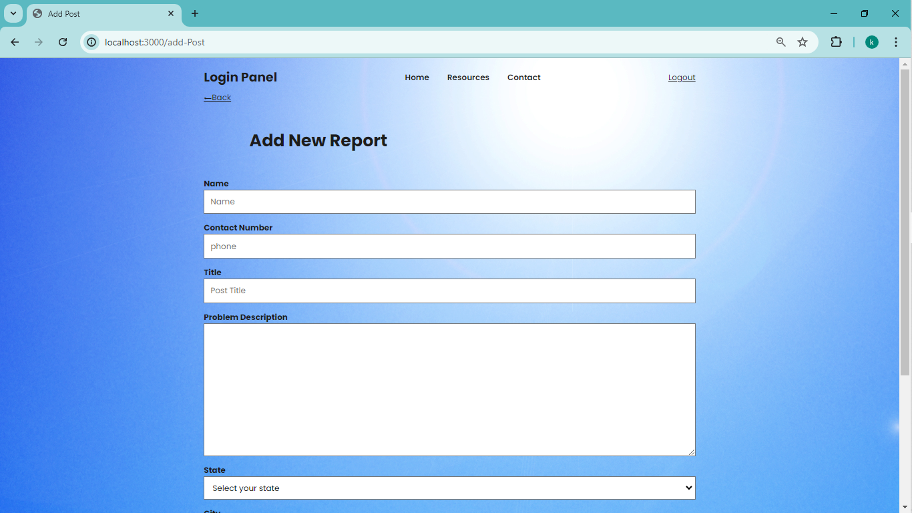
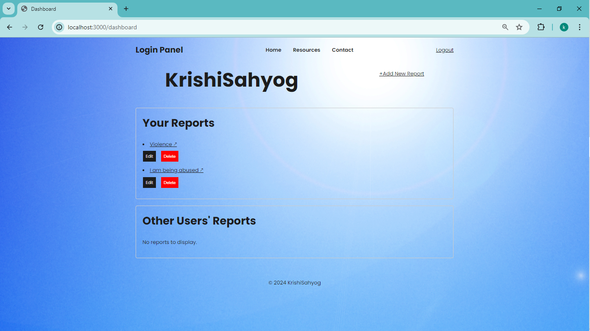
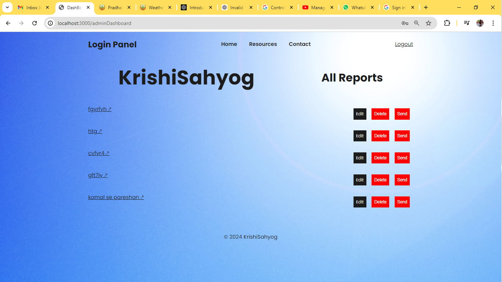

# KrishiSahyog

## Image Gallery

  

    
  

  

    
  

  

    
  

  

    
  

  

    
  

  

    
  

  

    
  

  

    
  

  

    
  

  

    
  

  

    
  

  
  

## Inspiration
The inspiration behind KrishiSahyog stems from the urgent need to combat agricultural fraud, which severely impacts farmers globally, especially those in rural areas with limited resources and access to information. The platform aims to empower farmers by providing a safe space to report incidents of fraud anonymously and to access educational resources that enhance their awareness and ability to prevent such fraudulent activities.

## What it does
KrishiSahyog is a web application that allows farmers to register and authenticate themselves. Once authenticated, farmers can create public posts detailing incidents of agricultural fraud, including types like counterfeit inputs, deceptive marketing, and land disputes. These posts include relevant details such as location, date, and supporting evidence (photos, documents). The platform ensures anonymity, protecting farmers from potential reprisals.

## How I built it
KrishiSahyog is built using:
- **Node.js** for backend development.
- **Express.js** for the web framework.
- **MongoDB** for the database.
- **JavaScript** for the frontend development.

Authentication mechanisms and CRUD operations are implemented to allow farmers to manage their posts securely. The OpenWeatherMap API is integrated to provide weather reports.

## Challenges I ran into
Developing robust anonymity features while ensuring usability and security posed significant challenges. Integrating authentication and authorization mechanisms seamlessly within the application was crucial to maintaining trust and reliability among users. Additionally, setting up an SMTP client to forward the reports to the authorities and follow up with them was challenging.

## Accomplishments that I'm proud of
I am proud to have created a platform that not only addresses the pressing issue of agricultural fraud but also empowers farmers with the tools and resources they need to protect themselves and their communities. The emphasis on anonymity and community-building fosters a supportive environment where farmers can share their experiences without fear.

## What I learned
Through building KrishiSahyog, I gained valuable insights into the complexities of agricultural fraud and the specific challenges faced by farmers in reporting such incidents. I also deepened my understanding of developing secure and user-friendly web applications that cater to a diverse user base.

## What's next for KrishiSahyog
In the future, I aim to expand KrishiSahyog by incorporating more interactive features such as forums or discussion boards where farmers can share insights and strategies for tackling agricultural challenges. I also plan to enhance the educational resources available on the platform to further empower farmers with knowledge and skills to safeguard their livelihoods. Additionally, I will make the website available in multiple regional languages.

## Built With
- [Express.js](https://expressjs.com/)
- [JavaScript](https://www.javascript.com/)
- [Node.js](https://nodejs.org/)
- [OpenWeatherMap API](https://openweathermap.org/api)
